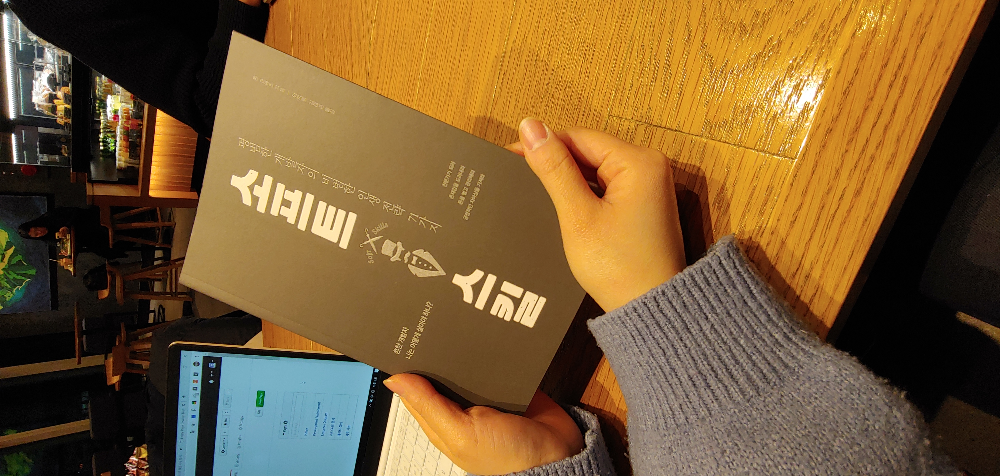

# 미팅 기록

## Database table review

- 지난 시간에 얘기했던 학생 <-> 과목의 관계에서 수업이 생성되는 기법 리뷰
- Relation table에 대한 이해

|유저|독서노트|책|
|----|----|----|
|**회원번호**|**회원번호**|**isbn**|
|닉네임|**isbn**|책제목|
|아이디|별점||		
|비밀번호|시작일||		
||완독일||		
||내용||		

- 간략 설명
  - 유저의 회원번호 PK, 독서노트의 회원번호 FK
  - 책의 isbn PK, 독서노트의 isbn FK
- 데이터베이스 중 RDB 관계 맺는 개념 꼭 확인하기

## Database 필요성?

- 클라이언트에 있어야 하는게 아니라면 결국 서버가 필요
- 서버는 DB의 데이터 말고도 알라딘 API를 통해 데이터를 얻을 수 있으므로
- 클라이언트가 서버에 요청해 데이터를 가져오게 하고, 서버가 판단해서 알라딘 API 호출 or DB Select 하기를 선택적으로 진행

## 서버의 추가적인 기능

- 항상 실행시켜 놓고 요청에 응답을 해야 하는 프로세스이므로
- 개발용 디버깅이 불가능 => 로그 파일을 쌓게 만들고 어느 시점에 예외/에러가 났는지 추적할 수 있도록 설정

## API Manager (client)

- 클라이언트는 서버에 대한 요청을 API Manager를 통해 할 것이므로 왜 필요한지에 대해 생각해 보기

## CORS

- Cross-Origin Resource Sharing 문제 미리 알려드림
- localhost는 왜 다른 도메인 주소를 가진 API를 호출할 수 없는가?

## 서버 및 DB 설계 구체화하기

- 어떤 프레임워크를 선정할지는 취향대로
- 역시 이런 환경과 프레임워크 언어를 결정을 한 이유가 설명되어야 함

## (추가) unit test는 왜 필요한가?

- 지금은 필요한지 아닌지, 좋은지 안좋은지 판단하기 어렵다면 따로 공부하고 리뷰해 보는 시간을 가져보는 것도 좋습니다.

## 진짜 하고 싶은 것이 무엇인지 다시 생각해보기

- 내 마음을 움직이게 하는 or 내가 해야만 하는 or 하고 싶은 일은?
- 개발이 아니라고요??? 그러면 이걸 왜 하는거죠??

## BookJournal을 진짜 하는 이유에 대해

- README.md 파일 첫 줄에 확실히 적어보세요.
- 처음부터 끝까지 내가 하고 싶은 프로젝트 경험을 위해서라고.

## 책 선물

- 아라님과 다섯번째 미팅을 진행했으므로 소프트 스킬 책을 선물로 드립니다.
- 